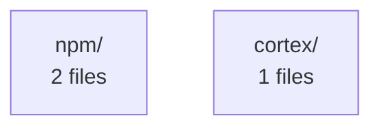

# Project Summary — Cortex Analysis

**Files analyzed:** 3
**Total constructs:** 16
**Security issues:** 0

## Languages
- javascript: 2 files
- python: 1 files

## Architecture

## Files Without Tests
**3 files** have no associated test files:

- `npm/bin/install.js`
- `npm/bin/cortex.js`
- `cortex/core.py`
