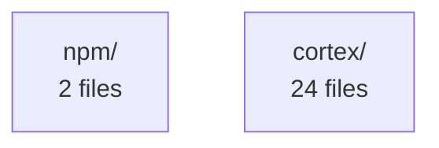

# Project Summary — Cortex Analysis

**Files analyzed:** 26
**Total constructs:** 67
**Security issues:** 0

## Languages
- javascript: 2 files
- python: 24 files

## Architecture

## Files Without Tests
**26 files** have no associated test files:

- `npm/bin/install.js`
- `npm/bin/cortex.js`
- `cortex/core.py`
- `cortex/__init__.py`
- `cortex/cli.py`
- `cortex/__main__.py`
- `cortex/mcp_server.py`
- `cortex/miners/cochange.py`
- `cortex/miners/__init__.py`
- `cortex/miners/git_history.py`
- `cortex/analyzers/python_analyzer.py`
- `cortex/analyzers/js_analyzer.py`
- `cortex/analyzers/__init__.py`
- `cortex/analyzers/base.py`
- `cortex/analyzers/go_analyzer.py`
