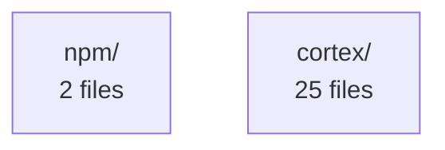

# Project Summary — Cortex Analysis

**Files analyzed:** 27
**Total constructs:** 81
**Security issues:** 0

## Languages
- javascript: 2 files
- python: 25 files

## Architecture

## Files Without Tests
**27 files** have no associated test files:

- `npm/bin/install.js`
- `npm/bin/cortex.js`
- `cortex/freshness.py`
- `cortex/core.py`
- `cortex/__init__.py`
- `cortex/__main__.py`
- `cortex/cli.py`
- `cortex/mcp_server.py`
- `cortex/miners/__init__.py`
- `cortex/miners/cochange.py`
- `cortex/analyzers/python_analyzer.py`
- `cortex/miners/git_history.py`
- `cortex/analyzers/js_analyzer.py`
- `cortex/analyzers/__init__.py`
- `cortex/analyzers/base.py`

## Context Freshness
Generated: 2026-03-21 21:50 UTC
Files: 27 analyzed
